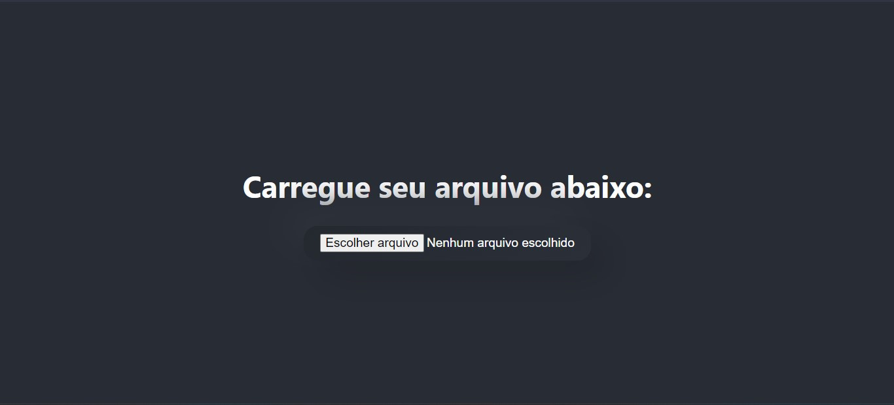

# Teste técnico Shopper - Projeto FullStack

## Enunciado

> Em qualquer empresa de e-commerce é essencial que os usuários possam atualizar os preços de
suas lojas para se manterem competitivos e manterem seus preços alinhados com os custos de
operação. Essa tarefa parece simples, porém quando falamos de lojas com milhares de produtos,
se torna essencial a existência de uma ferramenta que permita atualizar os produtos de forma
massiva e com recursos adicionais para evitar erros que possam prejudicar o negócio.


## Funcionalidades do projeto

O sistema deve:

- [x] Receber um arquivo csv, conforme o modelo abaixo, contendo o produto a ter seu preço modificado: <br>


- [x] Ao clicar o botão validar, o arquivo deve ser enviado por requisição para uma API onde será feita as verificações de validação

- [x] Caso a planilha esteja validada em conforme com as regras de negócio, aparecerá a mensagem de VALIDADO e habilitará o botão para envio a API, caso contrário o sistema exibirá uma mensagem informando sobre o erro

- [x] No backend a API irá validar se o arquivo segue o padrão proposto, se o valor a ser alterado é um valor válido, se o produto existe, etc.
A parte mais complexa do projeto é a que faz a veirificação para saber se o produto é um pacote ou se pertence ao pacote pois esses produtos seguem os valores um do outro.

- [x] Ao validar e enviar o arquivo, o sistema apresentará uma mensagem de conclusão positiva e os produtos serão modificados no banco de dados.

- [x] O fluxo de telas foi feito todo com renderização condicional

## Tecnologias empregadas

### BACK-END

    - NodeJS + Typescript 
    - Express
    - MySQL 8
    - Knex
    - Dotenv
    - Cors
    - Multer (biblioteca para manipulação do arquivo CSV)

### FRONT-END

    - React + JavaScript
    - Axios

## Instalação para executar o projeto localmente

- Fazer o dowload do arquivo
- Ou rodar o comando ```git clone https://github.com/BiancaPaccola/teste-tecnico-shopper.git```

### Instalar e rodar o BACK-END

Acessar a pasta do backend
```
cd backend
``` 
Instalar as dependências
```
npm install
``` 

Configurar as credencias para acessar seu banco de dados:
```
Criar um arquivo chamado .env na raiz do projeto com as seguintes variáveis:

DB_USER =           (usuário do seu banco de dados)
DB_PASSWORD =       (senha do seu banco de dados)
DB_HOST =           (endereço de ip do seu banco de dados)
DB_PORT =           (porta configurada no seu banco de dados)
DB_DATABASE_NAME =  (nome da sua base de dados, ou schema)
```

Criar e popular as tabelas (automatização com migrations)
```
npm run migrations
```

Colocar o projeto em execução
```
npm run dev
```

### Instalar e rodar o FRONT-END

Após instalar o backend, voltar para pasta raiz do repositório
```
cd ..
```

Acessar a pasta do front-end
```
cd frontend
```

Instalar as dependências
```
npm install
```

Executar o front no navegador
```
npm run start
```

## Prints dos fluxos de tela do projeto

### Tela inicial

### Arquivo carregado

### Validação negativa

### Validação positiva

### Tela final


